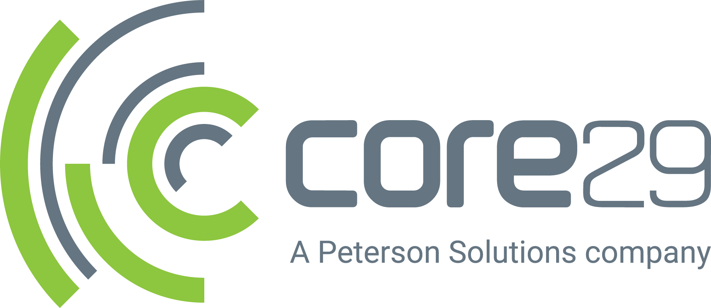
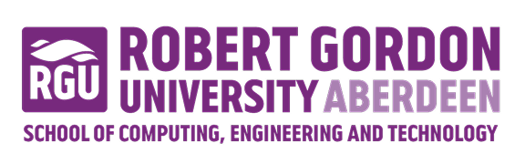

# Welcome to RGU Hack 26!
### This is the repo for your team
### At the end of the hack make sure to put all of your code into here for judging!
If you have any issues come to the help desk!

---
# The Challenges
The challenges for this year that have been chosen by our sponsors are below, pick one and get started using any languages or frameworks you like!

Challenges sponsored by:

 

## Core29 - [title]
  

## - Salus - [Title]

## - Sword - [Title]

## - SoCET - [Title]

-----

#### Join our discord server [https://discord.gg/MuntB88f](https://discord.gg/MuntB88f)
